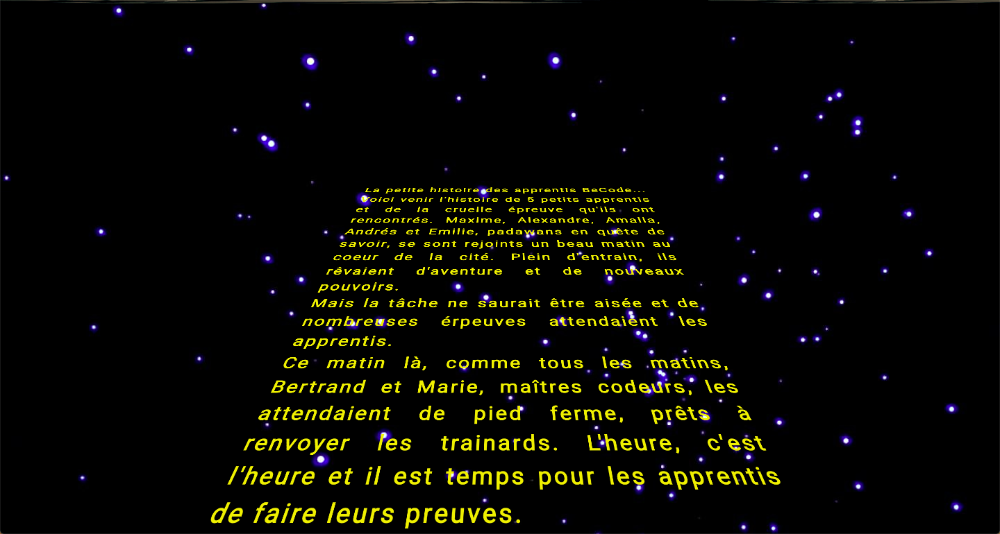

# StarWarsCrawl

After 15 days of training, we had to manage our first css animation and reproduce the famous Star Wars crawl.

objectives: 
- to master css animations and transformations
- add the Star Wars theme audio files
(the text used wes the one create during our first teamWork, at the end of the first week of training when we try to master git)

https://github.com/ebialais/StarWarsCrawl

